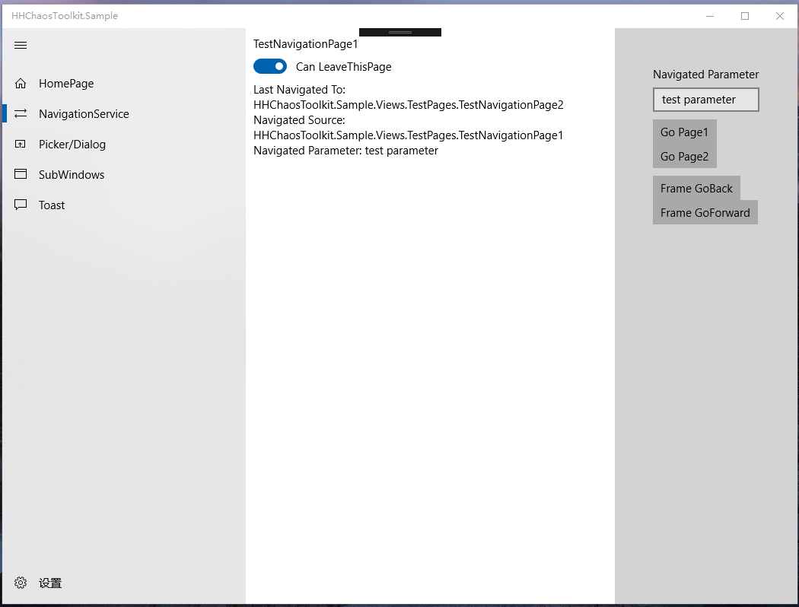
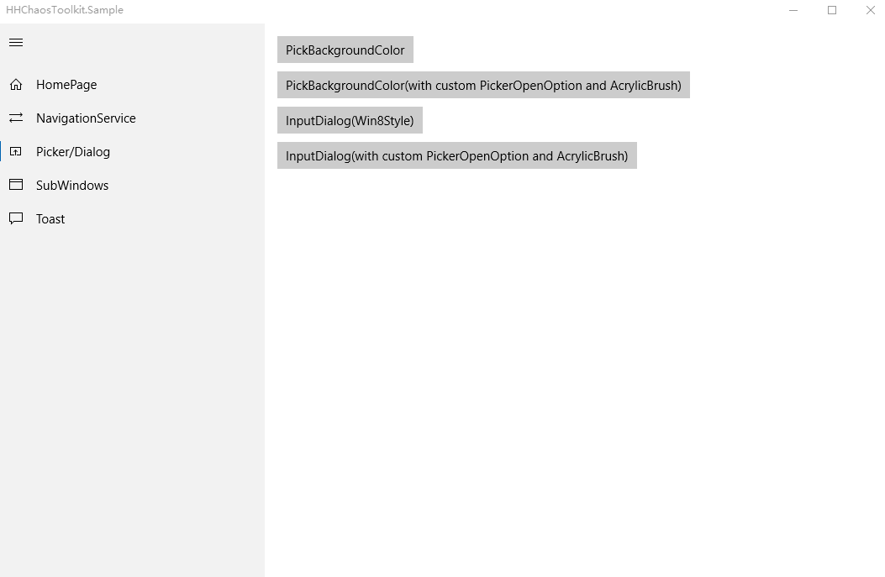
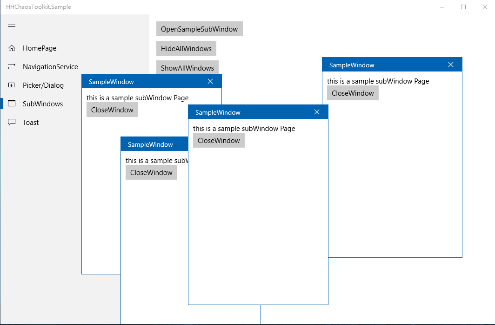
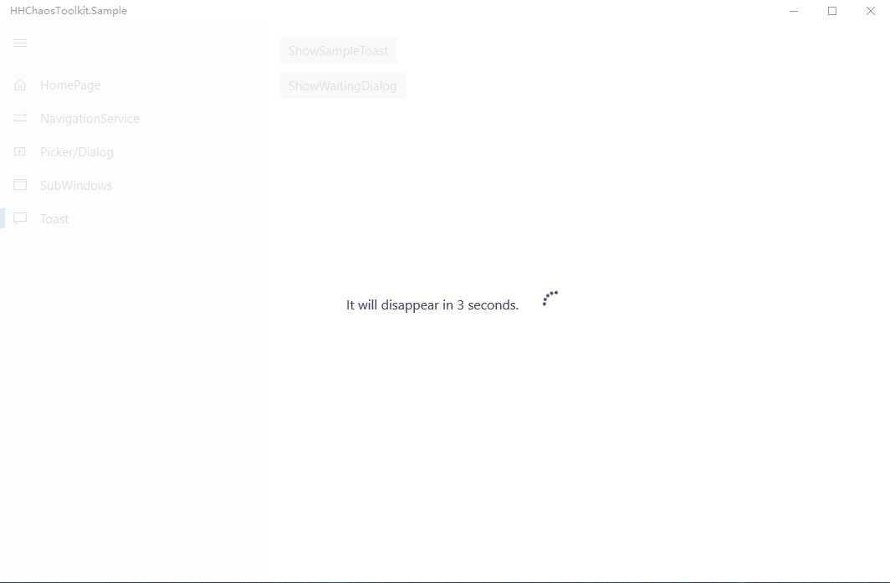

# HHChaosToolkit
HHChaosToolkit is a popup layer component library with MVVM framework.

HHChaosToolkit是一套适用于MVVM框架下使用的弹窗层组件库。他包括了以下部分：

- Picker弹窗组件（相关文章见下）

  - [[UWP]使用Popup构建UWP Picker](https://www.cnblogs.com/hhchaos/p/9961249.html)
  - [[UWP]使用Picker实现一个简单的ColorPicker弹窗](https://www.cnblogs.com/hhchaos/p/9961258.html)
- SubWindows子窗口组件
- 支持在ViewModle层传递参数的导航服务
- Toast/WaitingDialog控件

HHChaosToolkit可以从Nuget获取，也可以直接下载源码进行编译运行，查看Sample效果。

## Download
UWP:download from [Nuget](https://www.nuget.org/packages/HHChaosToolkit.UWP/)

## Sample App
[This is a sample app](https://github.com/HHChaos/HHChaosToolkit/tree/master/HHChaosToolkit.Sample)

### Screenshot:
* **NavigationService**
 
* **Picker/Dialog**
 
* **SubWindows**
 
* **Toast**
 
